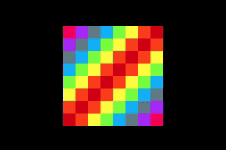

<!-- Project Logo -->

<h1 align="center">
    
     
</h1>

<!-- Project Shields -->

[![Javascript][js-image]][js-url]

<!-- Name of Project -->

# Jogo da Memória

<!-- Description -->

Jogo da memória desenvolvido em HTML5, CSS3 e Javascript.

<!-- Table of Contents -->

## 🗂 Tabela de Conteúdo

- [Tabela de Conteúdo](#tabela-de-conteúdo)
- [Sobre o Projeto](#sobre-o-projeto)
- [Tecnologias](#tec)
- [Contribuição](#contribuir)

<!-- About The Project -->

## 🖥 Sobre o projeto

O objetivo desta aplicação é a criação de um jogo de memória para estudos da linguagem de programação Javascript.

<!-- Technologies -->

## :rocket: Tecnologias 

Esse projeto foi desenvolvido com as seguintes tecnologias:

- [Javascript](https://www.javascript.com/)

<!-- Contribute -->

## 🤔 Como contribuir 

- Faça um fork desse repositório;
- Cria uma branch com a sua feature: `git checkout -b minha-feature`;
- Faça commit das suas alterações: `git commit -m 'feat: Minha nova feature'`;
- Faça push para a sua branch: `git push origin minha-feature`.

Depois que o merge da sua pull request for feito, você pode deletar a sua branch.

<!-- Shields -->

[js-image]: https://img.shields.io/badge/-Javascript-%23ea098a
[js-url]: https://www.javascript.com/